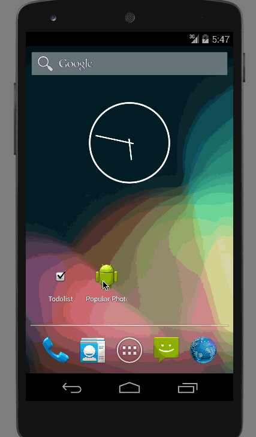

# InstagramClient
This is an Android demo application for displaying the popular photos from Instagram. See the [Instagram photo viewer](http://courses.codepath.com/courses/intro_to_android/week/1#!assignment) for details.

Time spent: 15 hours spent in total

Completed user stories:
 * [x] Required: User can scroll through current popular photos from Instagram
 * [x] Required: For each photo displayed, user can see the following details: Graphic, Caption, Username
 * [x] Optional: Displaying relative timestamp, like count, user profile image
 * [x] Optional: Show latest comment for each photo (bonus: show last 2 comments)
 * [x] Optional: Display each user profile image using a RoundedImageView

Walkthrough of all user stories:

GIF created with [LiceCap](http://www.cockos.com/licecap/).

